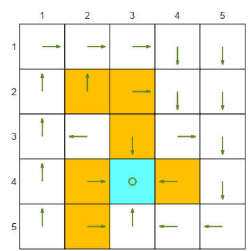
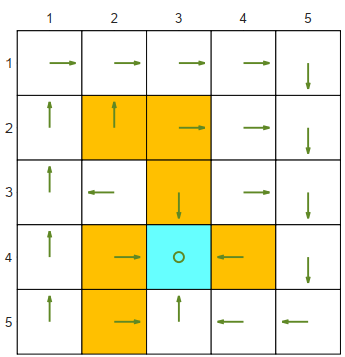

# A project to solve bellman equation to find state value of a given policy

In this project we will try to find the state value of a policy for a robot exploration task in a grid. The robot will try to explore its environment with these criteria:

1. The orange cells represent forbidden areas.
2. The blue cell represents the target area.
3. The reward settings are $r_{boundary} = r_{forbidden} = −1$ 
4. $r_{target} = 1$
5. Discount rate $\gamma = 0.9$ 

## First policy:

## Second policy:

