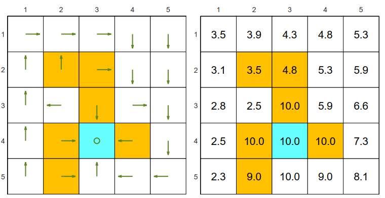

# A project to solve Bellman Optimality Equation (BOE) to find the optimal policy and optimal state value

In this project we will use value iteration and policy iteration (truncated policy iteration) to solve BOE

Elementwise form of BOE

$$
\begin{aligned}
v^*(s) &= \max_{\pi \in \Pi} \sum_{a \in A} \pi(a|s) \bigg( \sum_{r \in \mathcal{R}} p(r|s,a) r + \gamma \sum_{s' \in \mathcal{S}} p(s'|s,a) v^*(s') \bigg), \ s \in \mathcal{S}. \quad (1)
\end{aligned}
$$

In matrix form, the above equation can be written as

$$
\begin{aligned} 
v^* = \max_{\pi \in \Pi} \left( r_{\pi} + \gamma P_{\pi} v^* \right), \quad v^*, r_{\pi} \in \mathbb{R}^{|\mathcal{S}|},\ P_{\pi} \in \mathbb{R}^{|\mathcal{S}| \times |\mathcal{S}|} \qquad (2) 
\end{aligned}
$$

$$
\begin{aligned} 
[r_{\pi}]_{s} \doteq \sum_{a \in \mathcal{A}} \pi(a|s) \sum_{r \in \mathcal{R}} p(r|s,a) r, \quad [P_{\pi}]_{s,s'} \doteq \sum_{a \in \mathcal{A}} \pi(a|s) p(s'|s,a)
\end{aligned} 
$$

In terms of state-action value or q-value, BOE can be expressed as

$$ 
\begin{aligned}
q^*(s,a) = \sum_{r \in \mathcal{R}} p(r|s,a) r + \gamma \sum_{s' \in \mathcal{S}} p(s'|s,a) v^*(s') \qquad (3) 
\end{aligned}
$$

In matrix form, q-values in BOE can be expressed as

$$
\begin{aligned} 
\text{vec}(Q^*) = \text{vec}(R) + \gamma P v^*, \quad Q^*, R \in \mathbb{R}^{|\mathcal{S}| \times |\mathcal{A}|},\ P \in \mathbb{R}^{(|\mathcal{S}| \times |\mathcal{A}|) \times |\mathcal{S}|} \qquad (4)
\end{aligned}
$$

$$
\begin{aligned} 
[R]_{s,a} \doteq \sum_{r \in \mathcal{R}} p(r|s,a) r, \quad [P]_{(s,a),s'} \doteq p(s'|s,a)
\end{aligned}
$$

Using value iteration and policy iteration, we will show that the initial policy for a robot exploration problem in 5x5 grids world with these criteria:
1. The orange cells represent forbidden areas.
2. The blue cell represents the target area.
3. The reward settings are $r_{boundary} = −1$ and $r_{forbidden} = -10$
4. $r_{target} = 1$
5. Discount rate $\gamma = 0.9$ 

can reach the optimal policy of

